# Google Cloud Platform

## Work Instruction for Using App Engine

1. Go to ```App Engine``` menu and ```create aplication```.
<br>  <br>

2. Select the region which near by you. For me its ```asia-southeast-2``` region.
<br> 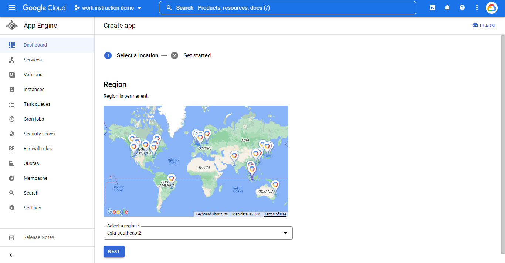 <br>

3. If you was entered to this display, it mean app engine set up was finished. Just click ```I’ll do this letter```.
<br>  <br>

4. You can see, after the app engine created the bucket was too. The name of bucket is ```empirical-state-358113.appspot.com```. it was linked each other.
<br>  <br>

5. Now we will create the bucket for some file to present on static web. Just go to the ```cloud storage``` option.
<br>  <br>

6. Fill the name of bucket what you want.
<br>  <br>

7. Select the region. I am select the ```asia``` one because its near by me.
<br>  <br>

8. Chose ```standard``` option and continue, because we just use this bucket for ```web static```. No need for special purpose.
<br>  <br>

9. Then let default option and click ```create```.
<br> 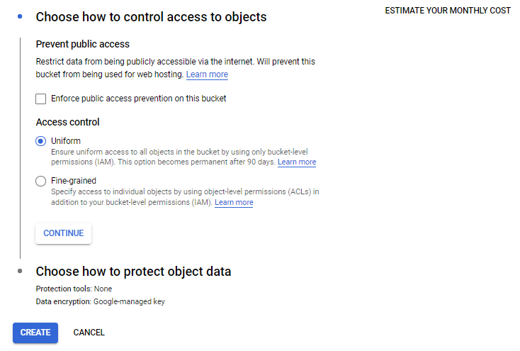 <br>

10. Bucket was created and now we upload some files to the bucket. Upload the file just drag and drop.
<br> 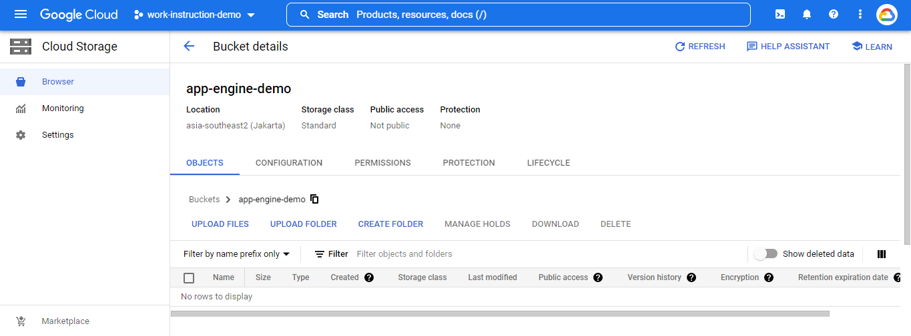 <br>

11. Go to the permission option, and then click ```add```.
<br> 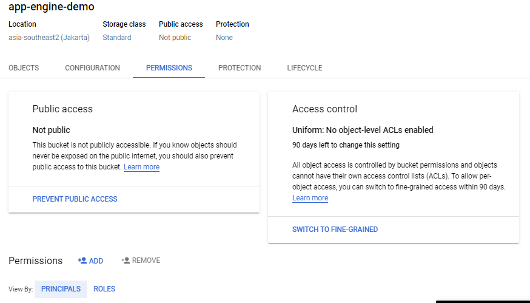 <br>

12. Follow this option to grant ```public access``` readable from internet and ```save```.
<br> 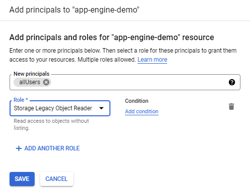 <br>

13. Click ```allow``` public acces.
<br> 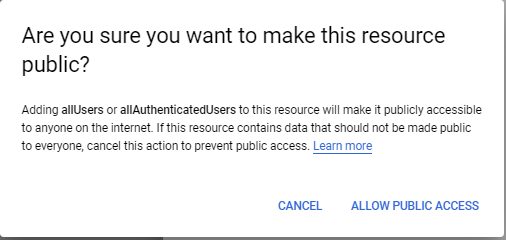 <br>

14. We can see now the bucket was grant readable public access.
<br> 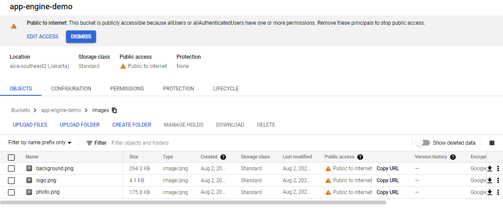 <br>

15. Right, now we will set up static website to access the files from this bucket. I already have source code to deploy in ```app engine```. You can download the source from https://github.com/teguhraisrahmadi/app-engine.git. Make sure you clone from ```source-code``` branch.
<br> 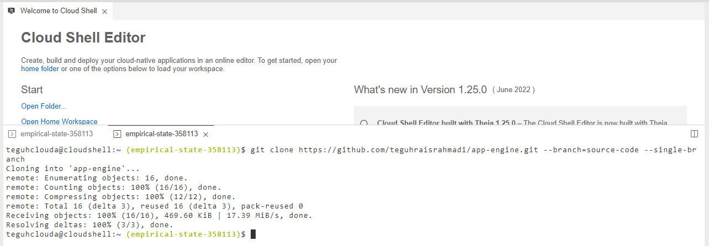 <br>

16. Now open the folder and adjust url from bucket to ```index.html```. just edit the image source.
<br> 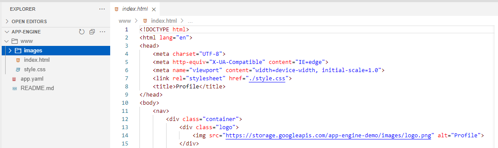 <br>
<br> 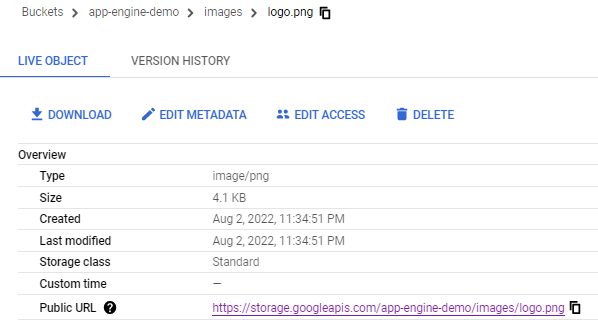 <br>
<br> 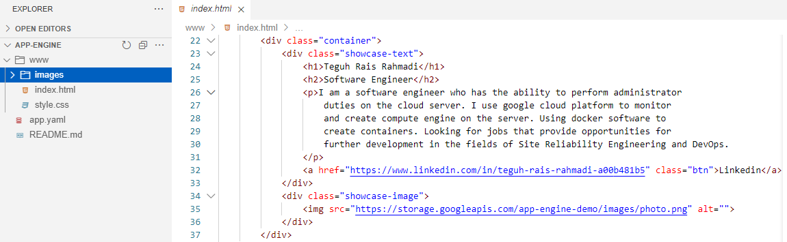 <br>
<br> 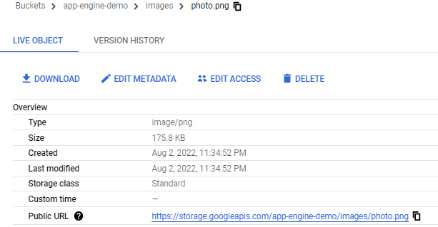 <br>

17. As well as ```style.css``` file. Just edit the source image.
<br> 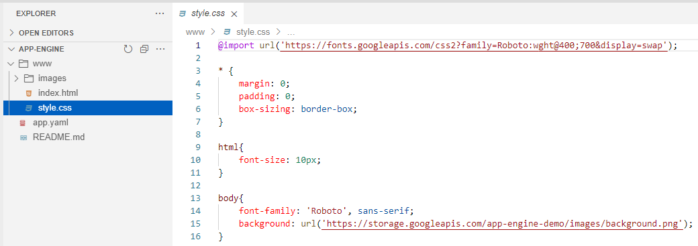 <br>
<br> 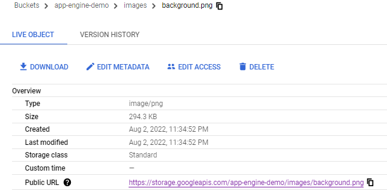 <br>

18. If you was done, just run command ```gcloud app deploy``` for build the code.
<br> 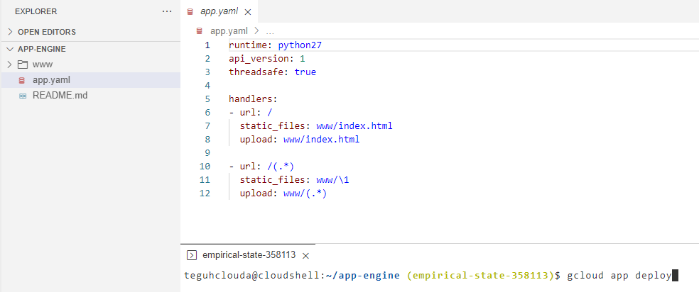 <br>

19. If you see error like this, make sure you was enabled the ```google cloud api services```. 
<br> 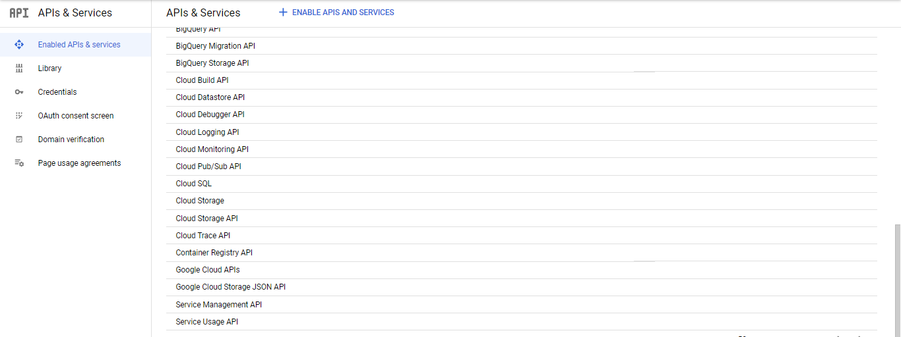 <br>
<br> 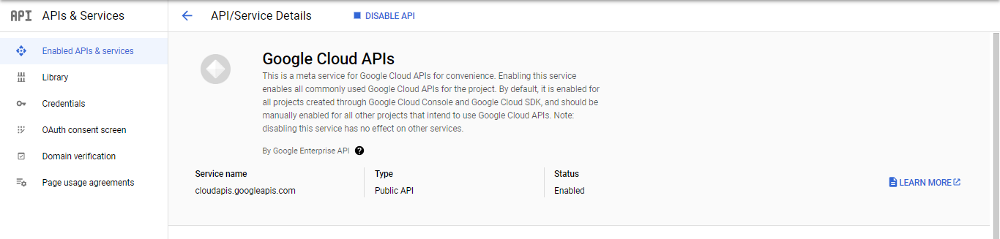 <br>

20. If was, just redeploy the code from editor to ```app engine``` again.
<br> 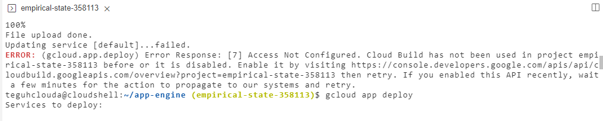 <br>
<br> 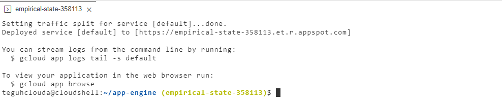 <br>

21. Done. You can access the web from https://empirical-state-358113.et.r.appspot.com
<br>  <br>
