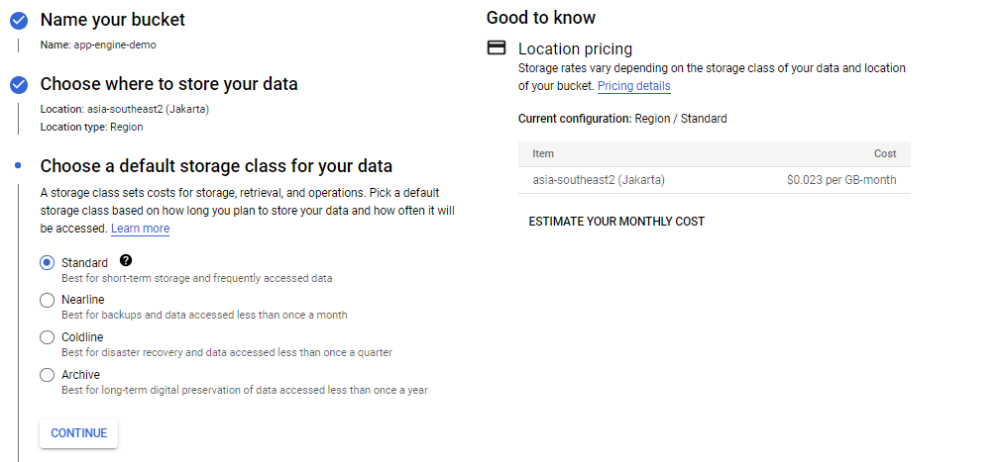

# Google Cloud Platform

## Work Instruction for Using App Engine

1. Go to ```App Engine``` menu and create aplication.
<br>  <br>

2. Select the region which near by you. For me its asia-southeast-2 region.
<br> !Capture](Material/2.png) <br>

3. If you was entered to this display, it mean app engine set up was finished. Just click “I’ll do this letter”.
<br>  <br>

4. You can see, after the app engine created the bucket was too. The name of bucket is “empirical-state-358113.appspot.com”. it was linked each other.
<br>  <br>

5. Now we will create the bucket for some file to present on static web. Just go to the cloud storage option.
<br>  <br>

6. Fill the name of bucket what you want.
<br>  <br>

7. Select the region. I am select the asia one because its near by me.
<br>  <br>

8. Chose standard option and continue, because we just use this bucket for web static. No need for special purpose.
<br>  <br>
